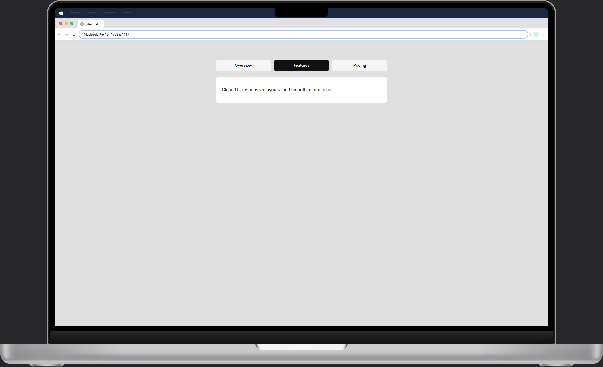

# Tabs 

A simple tabs component built with HTML, CSS, and JavaScript.

## Features
- Switch between multiple tabs
- Active state styling
- Clean and minimal design

## Screenshot

## What I Learned
- Handling multiple states with JS
- Using data attributes for dynamic UI
- Building reusable tab components
